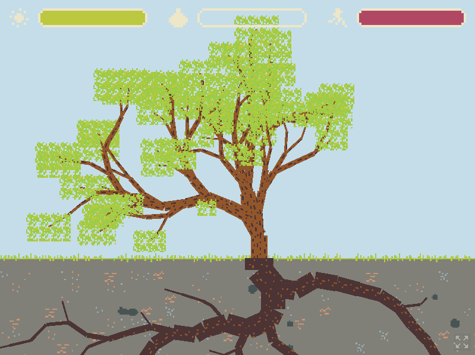

# My Little Tree

Grow your little tree. Control the tree’s roots to provide it with water and stability and watch the branches grow! Made in the amazing [Godot engine
](https://godotengine.org/) which I pretty much learned during this Ludum Dare.

Please see the [original submission page](https://ldjam.com/events/ludum-dare/48/my-little-tree) for more information about the game. You can play it on [the itch page](https://martindzejky.itch.io/my-little-tree).

Also, please excuse the messy code and random comments. It's a game jam after all 😆!
